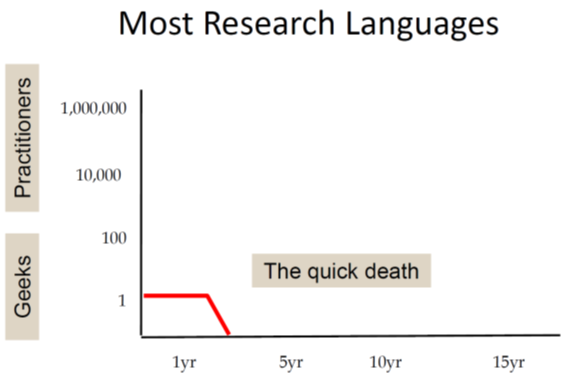
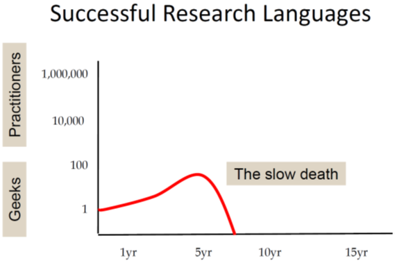
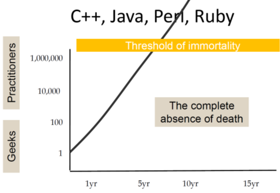
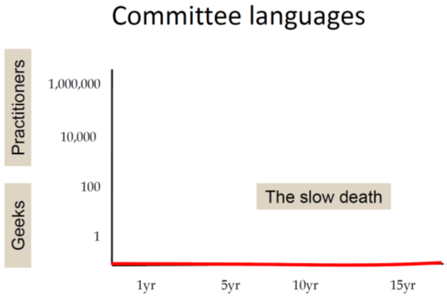

# Why Haskell Matters

This is a work in progress article.

## Motivation

Haskell was started as an academic research language in the late 1980ies.
It was never one of the most popular languages in the software industry.

So why should we spend our time on it?

Instead of answering this question directly I'd like to first have a closer look on the reception of 
Haskell in the software developers community:

### A strange development over time

In a talk in 2017 on [the Haskell journey](https://www.youtube.com/watch?v=re96UgMk6GQ) 
since its beginnings in the 1980ies Simon Peyton Jones speaks about the
rather unusual life story of Haskell.

First he shows a chart representing the typical life cycle of research languages. They are often created by 
a single researcher (who is also the single user) and most of them will be abandoned 
after just a few years:

A more successful research language gains some interest in a larger community 
but will still not escape the ivory tower and typically will die within ten years:

 

On the other hand we have popular programming languages that are quickly adopted by 
large number of users and thus reach "the threshold of immortality".
That is the base of existing code will grow so large that the language will 
be in use for decades:

 

In the next chart he rather jokingly depicts the sad fate of languages designed by committees.
They simply never take off:

 

Finally he presents a chart showing the Haskell timeline:

The development shown in this chart is rather unexpected and unusual: 
Haskell started as a research language and was even
designed by a committee; 
so in all probability it should have been abandoned long before the millennium!

But instead it gained some momentum in the early years followed by a rather quiet phase during 
the decade of OO hype (Java was released in 1995).
And then again we see a continuous growth of interest since about 2005. 
I'm writing this in early 2020 and we still see this trend.

### Being used versus being discussed

Then Simon Peyton Jones points out another interesting characteristic of the reception of Haskell 
in recent years.
In statics that rank programming languages by actual usage Haskell is typically not under the 30 most active languages.
But in statistics that rather rank programming languages by the volume of discussions in social media
Haskell typically scores much better (Often in the top ten).

So why is there so much talk about a language even if it is not one of the most active languages?

A very short answer might be: 
Haskell has a number of features that are clearly different from thiose of most other programming languages. 
Many of these features have proven to be powerful tools to solve basic problems of software development elegantly.

Therefore over time other programming languages have adapted parts of these concepts (e.g. pattern matching or type classes).
In many discussions about such concepts the origin from Haskell is mentioned.

This then contributes to the fact that e.g. Typescript, Scale or Rust developers start to deal with Haskell.

A further essential point is that Haskell is still an experimental laboratory for research in areas such as
compiler construction, programming languages, proofers, type systems etc.
Haskell is also inevitably always a topic of discussion in the discussion about these approaches. 

Haskell weist etliche Merkmale auf, die sich deutlich von den Konzepten der meisten anderen Programmiersprachen
unterscheiden. Viele dieser Merkmale haben sich als mächtige Werkzeuge erwiesen, um
einige grundlegende Probleme der Softwareentwicklung elegant zu lösen.
Daher haben im Laufe der Zeit andere Programmiersprachen Teile dieser Konzepte adaptiert (z.B. Pattern Matching oder Typklassen).
In vielen Diskussionen über solche Konzepte wird dann oft auf die Herkunft aus Haskell hingewiesen
und auf Abweichungen in der Umsetzung der Konzepte eingegangen.
Das trägt dann mit dazu bei, dass sich z.B. Typescript-, Skala- oder Rust- Entwickler anfangen sich mit Haskell zu beschäftigen.

Ein weiterer wesentlicher Punkt ist, dass Haskell immer noch ein Versuchslabor für Forschung in Bereichen wie
Compilerbau, Programmiersprachen, Beweiser, Typsysteme usw. ist.
Auch in der Diskussion über diese Ansätze wird zwangsläufig Haskell immer thematisiert. 

## So why is Haskell such a hot topic in the software development community?

> Haskell doesn't solve different problems than other languages.
> But it solves them differently.
> 
> -- unknown author

- Funktionen sind 1st class citizens (higher order functions, Funktionen könen neue Funktionen erzeugen und andere Funktionen als Argumente haben)

- Abstraktion über Resource management und Abarbeitung (=> deklarativ)

- Immutability ("Variables do not Vary")

- Seiteneffekte müssen in Funktions signaturen explizit gemacht werden.
D.H wenn keine Seiteneffekt angegeben ist, verhindert der Compiler, dass welche auftreten !
Damit lässt sich Seiteneffektfreie Programmierung realisieren ("Purity")

- Evaluierung in Haskell ist "non-strict" (aka "lazy"). Damit lassen sich z.B. abzählbar unendliche Mengen (z.B. alle Primzahlen) sehr elegant beschreiben.
  Aber auch kontrollstrukturen lassen sich so selbst bauen (super für DSLs) 

- Static and Strong typing (Es gibt kein Casting)

- Type Inferenz. Der Compiler kann die Typ-Signaturen von Funktionen selbst ermitteln. (Eine explizite Signatur ist aber möglich und oft auch sehr hilfreich für Doku und um Klarheit über Code zu gewinnen.)

- Polymorphie (Z.B für "operator overloading", Generische Container Datentypen, etc. auf Basis von "TypKlassen")

- Algebraische Datentypen (Summentypen + Produkttypen) AD helfen typische Fehler, di man von OO Polymorphie kenn zu vermeiden. Sie erlauben es, Code für  viele Oerationen auf Datentypen komplett automatisch vom Compiler generieren zu lassen).

- Pattern Matching erlaubt eine sehr klare Verarbeitung von ADTs

- Eleganz: Viele Algorithmen lassen sich sehr kompakt und nah an der Problemdomäne formulieren.

- Data Encapsulation durch Module

- Weniger Bugs durch

    - Purity, keine Seiteneffekte

    - Starke typisierung. Keine NPEs !

    - Hohe Abstraktion, Programme lassen sich oft wie eine deklarative Spezifikation des Algorithmus lesen

    - sehr gute Testbarkeit durch "Composobility"
    
        - das "ports & adapters" Beispiel: https://github.com/thma/RestaurantReservation
        
        - TDD / DDD
    
    - Memory Management (sehr schneller GC)

    - Modulare Programme. Es gibt ein sehr einfaches aber effektive Modul System und eine grosse Vielzahl kuratierter Bibliotheken.

    ("Ich habe in 5 Jahre Haskell noch nicht ein einziges Mal debuggen müssen")

- Performance: keine VM, sondern sehr optimierter Maschinencode. Mit ein wenig Feinschliff lassen sich oft Geschwindigkeiten wie bei handoptimiertem C-Code erreichen. 

## toc for code chapters (still in german)

- Werte
- Funktionen
- Listen
- Lazyness
    - List comprehension
    - Eigene Kontrollstrukturen
    
- Algebraische Datentypen
    - Summentypen : Ampelstatus
    - Produkttypen (int, int)
      Beispiel: Baum mit Knoten (int, Ampelstatus) dann mit map ein Ampelstatus
- deriving (Show, Read) für einfache Serialisierung
- Homoiconicity (Kind of)
- Maybe Datentyp
    - totale Funktionen
    - Verkettung von Maybe operationen  
      (um die "dreadful Staircase" zu vermeiden)
      => Monoidal Operations
      
 - explizite Seiten Effekte -> IO Monade
 
 - TypKlassen
   - Polymorphismus
     z.B. Num a, Eq a
   - Show, Read => Homoiconicity bei Serialisierung
   - Automatic deriving
     (Functor mit Baum Beispiel)
     
- Testbarkeit
    - TDD, higher order functions assembly, Typklassen dispatch (https://jproyo.github.io/posts/2019-03-17-tagless-final-haskell.html)