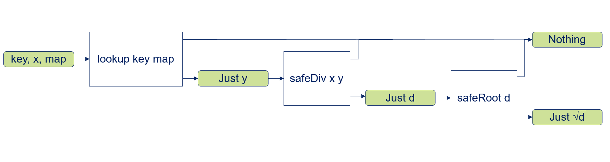

# Why Haskell Matters

[](https://github.com/thma/WhyHaskellMatters/actions)

> Haskell doesn't solve different problems than other languages.
> But it solves them differently.
> 
> -- unknown

## Abstract

In this article I try to explain why Haskell keeps being such an important language by presenting some
of its most important and distinguishing features and detailing them with working code examples.

The presentation aims to be self-contained and does not require any previous knowledge of the language.

The target audience are Haskell freshmen and developers with a background in non-functional languages who are eager
to learn about concepts of functional programming and Haskell in particular.

## Table of contents

- [Introduction](#introduction)
- [Functions are first class](#functions-are-first-class)
  - [Functions can be assigned to variables exactly as any other values](#functions-can-be-assigned-to-variables-exactly-as-any-other-values)
  - [Support for anonymous functions](#support-for-anonymous-functions)
  - [Functions can be returned as values from other functions](#functions-can-be-returned-as-values-from-other-functions)
    - [Function composition](#function-composition)
    - [Currying and Partial Application](#currying-and-Partial-Application)
  - [Functions can be passed as arguments to other functions](#functions-can-be-passed-as-arguments-to-other-functions)
- [Pattern matching](#pattern-matching)
- [Algebraic Data Types](#algebraic-data-types)
- [Polymorphic Data Types](#polymorphic-data-types)
  - [Lists](#lists)
    - [Arithmetic sequences](#arithmetic-sequences)
- [Immutability](#immutability)
- [Declarative programming](#declarative-programming)
  - [Mapping](#mapping)
  - [Folding](#folding)
- [Non-strict Evaluation](#non-strict-evaluation)
  - [Avoid endless loops](#avoid-endless-loops)
  - [Define potentially infinite data structures](#define-potentially-infinite-data-structures)
  - [List comprehension](#list-comprehension)
  - [Define control flow structures as abstractions](#define-control-flow-structures-as-abstractions)
- [Type Classes](#type-classes)
  - [Read and Show](#read-and-show)
  - [Functor and Foldable](#functor-and-foldable)
    - [Functor](#functor)
    - [Foldable](#foldable)
  - [The Maybe Monad](#the-maybe-monad)
    -  [Total Functions](#total-functions)
    -  [Composition of Maybe operations](#composition-of-maybe-operations)
  - [Purity](#purity)  
  - [Explicit side effects with the IO Monad](#explicit-side-effects-with-the-io-monad)
- [Conclusion](#conclusion)

## Introduction

Exactly thirty years ago, on April 1st 1990, a small group of researchers in the field of non-strict functional 
programming published the original Haskell language report.

Haskell never became one of the most popular languages in the software industry or part of the mainstream, 
but it has been and still is quite influential in the software development community.

In this article I try to explain why Haskell keeps being such an important language by presenting some
of its most distinguishing features and detailing them with working code examples.

The presentation aims to be self-contained and does not require any previous knowledge of the language.
I will also try to keep the learning curve moderate and to limit the scope of the presentation;
nevertheless this article is by no means a complete introduction to the language.

(If you are looking for thorough tutorials have a look at [Haskell Wikibook](https://en.wikibooks.org/wiki/Haskell) or
 [Learn You a Haskell](http://www.learnyouahaskell.com/.)

Before diving directly into the technical details I'd like to first have a closer look on the reception of 
Haskell in the software developers community:

### A strange development over time

In a talk in 2017 on [the Haskell journey](https://www.youtube.com/watch?v=re96UgMk6GQ) 
since its beginnings in the 1980ies Simon Peyton Jones speaks about the
rather unusual life story of Haskell.

First he talks about the typical life cycle of research languages. They are often created by 
a single researcher (who is also the single user), and most of them will be abandoned 
after just a few years.

A more successful research language might gain some interest in a larger community 
but will still not escape the ivory tower and typically will be given up within ten years.

On the other hand we have all those popular programming languages that are quickly adopted by 
large numbers of developers and thus reach "the threshold of immortality".
That is the base of existing code will grow so large that the language will 
be in use for decades.

A little jokingly he then depicts the sad fate of languages designed by 
committees by flat line through zero: They simply never take off.

Finally, he presents a chart showing the Haskell timeline:


The development shown in this chart seems rather unexpected: 
Haskell started as a research language and was even designed by a committee; 
so in all probability it should have been abandoned long before the millennium!

Instead, it gained some momentum in its early years followed by a rather quiet phase during 
the decade of OO hype (Java being released in 1995).
And then again we see a continuous growth of interest since about 2005. 
I'm writing this in early 2020, and we still see this trend!

### Being used versus being discussed

Then Simon Peyton Jones points out another interesting characteristic of the reception of Haskell 
in recent years:
In statistics that rank programming languages by actual usage Haskell is typically not under the 30 most active languages.
But in statistics that instead rank languages by the volume of discussions on the internet
Haskell typically scores much better (often in the top ten).

### So why does Haskell keep being a hot topic in the software development community?

A very *short answer* might be: 
Haskell has a number of features that are clearly different from those of most other programming languages. 
Many of these features have proven to be powerful tools to solve basic problems of software development elegantly.

Therefore, over time other programming languages have adopted parts of these concepts (e.g. pattern matching or type classes).
In discussions about such concepts the Haskell heritage is mentioned 
and differences between the original Haskell concepts and those of other languages are discussed.
Sometimes people feel encouraged to have a closer look at the source of these concepts to get a deeper understanding of
their original intentions. That's why we see a growing number of developers working in
Python, Typescript, Scala, Rust, C++, C# or Java starting to dive into Haskell.

A further essential point is that Haskell is still an experimental laboratory for research in areas such as
compiler construction, programming language design, theorem-provers, type systems etc.
So inevitably Haskell will be a topic in the discussion about these approaches.

In the following sections we will try to find the *longer answer* by
studying some of the most distinguishing features of Haskell.

## Functions are First-class

> In computer science, a programming language is said to have first-class functions if it treats functions as 
> first-class citizens. This means the language supports **passing functions as arguments to other functions**, 
> **returning them as the values from other functions**, and **assigning them to variables or storing them in data 
> structures.**[1] Some programming language theorists require **support for anonymous functions** (function literals) 
> as well.[2] In languages with first-class functions, the names of functions do not have any special status; 
> they are treated like ordinary variables with a function type.
> 
> quoted from [Wikipedia](https://en.wikipedia.org/wiki/First-class_function)

We'll go through this one by one:

### Functions can be assigned to variables exactly as any other values

Let's have a look how this looks like in Haskell. First we define some simple values:

```haskell
-- define constant `aNumber` with a value of 42. 
aNumber :: Integer
aNumber = 42

-- define constant `aString` with a value of "hello world"
aString :: String
aString = "Hello World"
```

In the first line we see a type signature that defines the constant `aNumber` to be of type `Integer`.
In the second line we define the value of `aNumber` to be `42`.
In the same way we define the constant `aString` to be of type `String`.

Haskell is a statically typed language: all type checks happen at compile time.
Static typing has the advantage that type errors don't happen at runtime. 
This is especially useful if a function signature is changed and this change 
affects many dependent parts of a project: the compiler will detect the breaking changes
at all affected places.

The Haskell Compiler also provides *type inference*, which allows the compiler to deduce the concrete data type
of an expression from the context.
Thus, it is usually not required to provide type declarations. 
Nevertheless, using explicit type signatures is considered good style as they are an important element of a 
comprehensive documentation.

Next we define a function `square` that takes an integer argument and returns the square value of the argument:
```Haskell
square :: Integer -> Integer
square x = x * x
```

Definition of a function works exactly in the same way as the definition of any other value.
The only thing special is that we declare the type to be a **function type** by using the `->` notation.
So `:: Integer -> Integer` represents a function from `Integer` to `Integer`.
In the second line we define function `square` to compute `x * x` for any `Integer` argument `x`.

Ok, seems not too difficult, so let's define another function `double` that doubles its input value:

```haskell
double :: Integer -> Integer
double n = 2 * n
```

### Support for anonymous functions

Anonymous functions, also known as lambda expressions, can be defined in Haskell like this:

```Haskell
\x -> x * x
```

This expression denotes an anonymous function that takes a single argument x and returns the square of that argument.
The backslash is read as λ (the greek letter lambda). 

You can use such as expressions everywhere where you would use any other function. For example you could apply the 
anonymous function `\x -> x * x` to a number just like the named function `square`:

```haskell
-- use named function:
result = square 5

-- use anonymous function:
result' = (\x -> x * x) 5
```

We will see more useful applications of anonymous functions in the following section.

### Functions can be returned as values from other functions

#### Function composition

Do you remember *function composition* from your high-school math classes? 
Function composition is an operation that takes two functions `f` and `g` and produces a function `h` such that 
`h(x) = g(f(x))`
The resulting composite function is denoted `h = g ∘ f` where  `(g ∘ f )(x) = g(f(x))`.
Intuitively, composing functions is a chaining process in which the output of function `f` is used as input of function `g`.

So looking from a programmers perspective the `∘` operator is a function that 
takes two functions as arguments and returns a new composite function.

In Haskell this operator is represented as the dot operator `.`:

```haskell
(.) :: (b -> c) -> (a -> b) -> a -> c
(.) f g x = f (g x)
```

The brackets around the dot are required as we want to use a non-alphabetical symbol as an identifier.
In Haskell such identifiers can be used as infix operators (as we will see below).
Otherwise `(.)` is defined as any other function. 
Please also note how close the syntax is to the original mathematical definition.

Using this operator we can easily create a composite function that first doubles 
a number and then computes the square of that doubled number:

```haskell
squareAfterDouble :: Integer -> Integer
squareAfterDouble = square . double
```

#### Currying and Partial Application

In this section we look at another interesting example of functions producing 
other functions as return values.
We start by defining a function `add` that takes two `Integer` arguments and computes their sum:

```haskell
-- function adding two numbers 
add :: Integer -> Integer -> Integer
add x y = x + y
```

This look quite straightforward. But still there is one interesting detail to note:
the type signature of `add` is not something like 

```haskell
add :: (Integer, Integer) -> Integer
```

Instead it is:

```haskell
add :: Integer -> Integer -> Integer
```

What does this signature actually mean?
It can be read as "A function taking an Integer argument and returning a function of type `Integer -> Integer`".
Sounds weird? But that's exactly what Haskell does internally. 
So if we call `add 2 3` first `add` is applied to `2` which return a new function of type `Integer -> Integer` which is then applied to `3`.

This technique is called [**Currying**](https://wiki.haskell.org/Currying)

Currying is widely used in Haskell as it allows another cool thing: **partial application**.

In the next code snippet we define a function `add5` by partially applying the function `add` to only one argument:

```haskell
-- partial application: applying add to 5 returns a function of type Integer -> Integer
add5 :: Integer -> Integer
add5 = add 5
```

The trick is as follows: `add 5` returns a function of type `Integer -> Integer` which will add `5` to any Integer argument.

Partial application thus allows us to write functions that return functions as result values.
This technique is frequently used to 
[provide functions with configuration data](https://github.com/thma/LtuPatternFactory#dependency-injection--parameter-binding-partial-application).

### Functions can be passed as arguments to other functions

I could keep this section short by telling you that we have already seen an example for this:
the function composition operator `(.)`.
It **accepts two functions as arguments** and returns a new one as in:

```haskell
squareAfterDouble :: Integer -> Integer
squareAfterDouble = square . double
```

But I have another instructive example at hand.

Let's imagine we have to implement a function that doubles any odd Integer:

```haskell
ifOddDouble :: Integer -> Integer
ifOddDouble n =
  if odd n
    then double n
    else n
```

The Haskell code is straightforward: new ingredients are the `if ... then ... else ...` and the
odd `odd` which is a predicate from the Haskell standard library 
that returns `True` if an integral number is odd.

Now let's assume that we also need another function that computes the square for any odd number:

```haskell
ifOddSquare :: Integer -> Integer
ifOddSquare n =
  if odd n
    then square n
    else n
```

As vigilant developers we immediately detect a violation of the 
[Don't repeat yourself principle](https://en.wikipedia.org/wiki/Don%27t_repeat_yourself) as 
both functions only vary in the usage of a different growth functions `double` versus `square`.

So we are looking for a way to refactor this code by a solution that keeps the original
structure but allows to vary the used growth function.

What we need is a function that takes a growth function (of type `(Integer -> Integer)`) 
as first argument, an `Integer` as second argument
and returns an `Integer`. The specified growth function will be applied in the `then` clause:

```haskell
ifOdd :: (Integer -> Integer) -> Integer -> Integer
ifOdd growthFunction n =
  if odd n
    then growthFunction n
    else n
```

With this approach we can refactor `ifOddDouble` and `ifOddSquare` as follows:

```haskell
ifOddDouble :: Integer -> Integer
ifOddDouble n = ifOdd double n

ifOddSquare :: Integer -> Integer
ifOddSquare n = ifOdd square n
```

Now imagine that we have to implement new function `ifEvenDouble` and `ifEvenSquare`, that
will work only on even numbers. Instead of repeating ourselves we come up with a function
`ifPredGrow` that takes a predicate function of type `(Integer -> Bool)` as first argument, 
a growth function of type `(Integer -> Integer)` as second argument and an Integer as third argument, 
returning an `Integer`.

The predicate function will be used to determine whether the growth function has to be applied:

```haskell
ifPredGrow :: (Integer -> Bool) -> (Integer -> Integer) -> Integer -> Integer
ifPredGrow predicate growthFunction n =
  if predicate n
    then growthFunction n
    else n
```

Using this [higher order function](https://en.wikipedia.org/wiki/Higher-order_function) 
that even takes two functions as arguments we can write the two new functions and 
further refactor the existing ones without breaking the DRY principle:

```haskell
ifEvenDouble :: Integer -> Integer
ifEvenDouble n = ifPredGrow even double n

ifEvenSquare :: Integer -> Integer
ifEvenSquare n = ifPredGrow even square n

ifOddDouble'' :: Integer -> Integer
ifOddDouble'' n = ifPredGrow odd double n

ifOddSquare'' :: Integer -> Integer
ifOddSquare'' n = ifPredGrow odd square n
```

## Pattern matching

With the things that we have learnt so far, we can now start to implement some more interesting functions.
So what about implementing the recursive [factorial function](https://en.wikipedia.org/wiki/Factorial)?

The factorial function can be defined as follows:
 
> For all n ∈ ℕ<sub>0</sub>:
>```
>0! = 1
>n! = n * (n-1)!
>```

With our current knowledge of Haskell we can implement this as follows:

```haskell
factorial :: Natural -> Natural
factorial n =
  if n == 0
    then 1
    else n * factorial (n - 1)
```

We are using the Haskell data type `Natural` to denote the set of non-negative integers ℕ<sub>0</sub>.
Using the literal `factorial` within the definition of the function `factorial` works as expected and denotes a 
recursive function call.

As these kind of recursive definition of functions are typical for functional programming, the language designers have
added a useful feature called *pattern matching* that allows to define functions by a set of equations:

```haskell
fac :: Natural -> Natural
fac 0 = 1
fac n = n * fac (n - 1)
```

This style comes much closer to the mathematical definition and is typically more readable, as it helps to avoid
nested `if ... then ... else ...` constructs.

Pattern matching can not only be used for numeric values but for any other data types. 
We'll see some more examples shortly.

## Algebraic Data Types

Haskell supports user-defined data types by making use of a well thought out concept.
Let's start with a simple example:

```haskell
data Status = Green | Yellow | Red
```

This declares a data type `Status` which has exactly three different instances. For each instance a
*data constructor* is defined that allows to create a new instance of the data type.

Each of those data constructors is a function (in this simple case a constant) that returns a `Status` instance.

The type `Status` is a so called *sum type* as it is represents the set defined by the sum of all three 
instances `Green`, `Yellow`, `Red`. In Java this corresponds to Enumerations.

Let's assume we have to create a converter that maps our `Status` values to `Severity` values 
representing severity levels in some other system.
This converter can be written using the pattern matching syntax that we already have seen above:

```haskell
-- another sum type representing severity:
data Severity = Low | Middle | High deriving (Eq, Show)

severity :: Status -> Severity
severity Green  = Low
severity Yellow = Middle
severity Red    = High
```

The compiler will tell us when we did not cover all instances of the `Status` type 
(by making use of the `-fwarn-incomplete-patterns` pragma).

Now we look at data types that combine multiple different elements, like pairs n-tuples, etc.
Let's start with a `PairStatusSeverity` type that combines two different elements:

```haskell
data PairStatusSeverity = P Status Severity
```

This can be understood as: data type `PairStatusSeverity` can be constructed from a
data constructor `P` that takes a value of type `Status` and a value of type `Severity` and returns a `Pair` instance.

So for example `P Green High` returns a `PairStatusSeverity` instance
(the data constructor `P`  has the signature `P :: Status -> Severity -> PairStatusSeverity`).

The type `PairStatusSeverity` can be interpreted as the set of all possible ordered pairs of Status and Severity values, 
that is the *cartesian product* of `Status` and `Severity`.

That's why such a data type is called *product type*. 

Haskell allows you to create arbitrary data types by combining *sum types* and *product types*. The complete
range of data types that can be constructed in this way is called 
[*algebraic data types*](https://en.wikipedia.org/wiki/Algebraic_data_type) or ADT in short.

Using algebraic data types has several advantages:

- Pattern matching can be used to analyze any concrete instance to select different behaviour based on input data.
  as in the example that maps `Status` to `Severity` there is no need to use `if..then..else..` constructs.
- The compiler can detect incomplete patterns matching or other flaws.
- The compiler can derive many complex functionality automatically for ADTs as they are constructed in
  such a regular way.
  
We will cover the interesting combination of ADTs and pattern matching in the following sections.  
  
## Polymorphic Data Types

Forming pairs or more generally n-tuples is a very common task in programming. 
Therefore it would be inconvenient and repetitive if we were forced to create new Pair or Tuple types
for each concrete usage. consider the following example:

```haskell
data PairStatusSeverity = P Status Severity

data PairStatusString   = P' Status String

data PairSeverityStatus = P'' Severity Status
```

Luckily data type declarations allow to use type variables to avoid this kind of cluttered code.
So we can define a generic data type `Pair` that allows us to freely combine different kinds of arguments:

```haskell
-- a simple polymorphic type
data Pair a b = P a b
```

This can be understood as: data type `Pair` uses two elements of (potentially) different types `a` and `b`; the
data constructor `P` takes a value of type `a` and a value of type `b` and returns a `Pair a b` instance 
(the data constructor `P`  has the signature `P :: a -> b -> Pair a b`).
The type `Pair` can now be used to create many different concrete data types it is thus 
called a *polymorphic* data type.
As the Polymorphism is defined by type variables, i.e. parameters to the type declarations, this mechanism is
called *parametric polymorphism*.

As pairs and n-tuples are so frequently used, the Haskell language designers have added some syntactic sugar to
work effortlessly with them.

So you can simply write tuples like this:

```haskell
tuple :: (Status, Severity, String)
tuple = (Green, Low, "All green")
```

### Lists

Another very useful polymorphic type is the `List`.

A list can either be the empty list (denoted by the data constructor `[]`) 
or some element of a data type `a` followed by a list with elements of type `a`, denoted by `[a]`.

This intuition is reflected in the following data type definition:

```haskell
data [a] = [] | a : [a]
```

The cons operator `(:)` (which is an infix operator like `(.)` from the previous section) is declared as a 
*data constructor* to construct a list from a single element of type `a` and a list of type `[a]`.

So a list containing only a single element `1` is constructed by:

```haskell
1 : []
```

A list containing the three numbers 1, 2, 3 is constructed like this:

```haskell
1 : 2 : 3 : []
```

Luckily the Haskell language designers have been so kind to offer some syntactic sugar for this. 
So the first list can simply be written as `[1]` and the second as `[1,2,3]`.

Polymorphic type expressions describe *families of types*. 
For example, `(forall a)[a]` is the family of types consisting of, 
for every type `a`, the type of lists of `a`. 
Lists of integers (e.g. `[1,2,3]`), lists of characters (`['a','b','c']`), 
even lists of lists of integers, etc., are all members of this family. 

Function that work on lists can use pattern matching to select behaviour for the `[]` and the `a:[a]` case.

Take for instance the definition of the function `length` that computes the length of a list:

```haskell
length :: [a] -> Integer
length []     =  0
length (x:xs) =  1 + length xs
```

We can read these equations as: The length of the empty list is 0, 
and the length of a list whose first element is x and remainder is xs 
is 1 plus the length of xs.


In our next example we want to work with a of some random integers:
```haskell
someNumbers :: [Integer]
someNumbers = [49,64,97,54,19,90,934,22,215,6,68,325,720,8082,1,33,31]
```

Now we want to select all even or all odd numbers from this list. 
We are looking for a function `filter` that takes two
arguments: first a predicate function that will be used to check each element
and second the actual list of elements. The function will return a list with all matching elements.
And of course our solution should work not only for Integers but for any other types as well.
Here is the type signature of such a filter function:

```haskell
filter :: (a -> Bool) -> [a] -> [a]
```

In the implementation we will use pattern matching to provide different behaviour for the `[]` and the `(x:xs)` case:

```haskell
filter :: (a -> Bool) -> [a] -> [a]
filter pred []     = []
filter pred (x:xs)
  | pred x         = x : filter pred xs
  | otherwise      = filter pred xs
```

The `[]` case is obvious. To understand the `(x:xs)` case we have to know that in addition to simple matching of the type constructors
we can also use *pattern guards* to perform additional testing on the input data.
In this case we compute `pred x` if it evaluates to `True`, `x` is a match and will be cons'ed with the result of 
`filter pred xs`.
If it does not evaluate to `True`, 
we will not add `x` to the result list and thus simply call filter recursively on the remainder of the list.

Now we can use `filter` to select elements from our sample list:

```haskell
someEvenNumbers :: [Integer]
someEvenNumbers = filter even someNumbers

-- predicates may also be lambda-expresssions
someOddNumbers :: [Integer]
someOddNumbers = filter (\n -> n `rem` 2 /= 0) someNumbers  
```

Of course we don't have to invent functions like `filter` on our own but can rely on the [extensive set of 
predefined functions working on lists](https://hackage.haskell.org/package/base-4.12.0.0/docs/Data-List.html) 
in the Haskell base library.

#### Arithmetic sequences

There is a nice feature that often comes in handy when dealing with lists of numbers. It's called *arithmetic sequences* and
allows you to define lists of numbers with a concise syntax:

```haskell
upToHundred :: [Integer]
upToHundred = [1..100]
```

As expected this assigns `upToHundred` with a list of integers from 1 to 100.

It's also possible to define a step width that determines the increment between the subsequent numbers.
If we want only the odd numbers we can construct them like this:
```haskell
oddsUpToHundred :: [Integer]
oddsUpToHundred = [1,3..100]
```

Arithmetic sequences can also be used in more dynamic cases. For example we can define the `factorial` function like this:
```math
n! = 1 * 2 * 3 ... (n-2) * (n-1) * n, for integers > 0
```

In Haskell we can use an arithmetic sequence to define this function:

```haskell
fac' n   = prod [1..n]
```

## Immutability

> In object-oriented and functional programming, an immutable object is an object 
> whose state cannot be modified after it is created. This is in contrast to a mutable object 
> (changeable object), which can be modified after it is created.
>  
> Quoted from [Wikipedia](https://en.wikipedia.org/wiki/Immutable_object)

This is going to be a very short section. In Haskell all data is immutable. Period.

Let's look at some interactions with the Haskell GHCi REPL (whenever you see the `λ>` prompt in this article 
it is from a GHCi session):

```haskell
λ> a = [1,2,3]
λ> a
[1,2,3]
λ> reverse a
[3,2,1]
λ> a
[1,2,3]
```

In Haskell there is no way to change the value of `a` after its initial creation. There are no *destructive* 
operations available unlike some other functional languages such as Lisp, Scheme or ML.

The huge benefit of this is that refactoring becomes much simpler than in languages where every function or method
might mutate data. Thus it will also be easier to reason about a given piece of code.

Of course this also makes programming of concurrent operations much easier. With a *shared nothing* approach, 
Haskell programs are automatically thread-safe.

## Declarative programming

In this section I want to explain how programming with *higher order* functions can be used to
factor out many basic control structures and algorithms from the user code.

This will result in a more *declarative programming* style where the developer can simply 
declare *what* she wants to achieve but is not required to write down *how* it is to be achieved.

Code that applies this style will be much denser, and it will be more concerned with the actual elements
of the problem domain than with the technical implementation details.

### Mapping

We'll demonstrate this with some examples working on lists. 
First we get the task to write a function that doubles all elements of a `[Integer]` list.
We want to reuse the `double` function we have already defined above.

With all that we have learnt so far, writing a function `doubleAll` isn't that hard:

```haskell
-- compute the double value for all list elements
doubleAll :: [Integer] -> [Integer]
doubleAll [] = []
doubleAll (n:rest) = double n : doubleAll rest
```

Next we are asked to implement a similar function `squareAll` that will use `square` to compute the square of all elements in a list.
The naive way would be to implement it in the *WET* (We Enjoy Typing) approach:

```haskell
-- compute squares for all list elements
squareAll :: [Integer] -> [Integer]
squareAll [] = []
squareAll (n:rest) = square n : squareAll rest
```

Of course this is very ugly: 
both function use the same pattern matching and apply the same recursive iteration strategy.
They only differ in the function applied to each element.

As role model developers we don't want to repeat ourselves.  We are thus looking for something that 
captures the essence of mapping a given function over a list of elements:

```haskell
map :: (a -> b) -> [a] -> [b]
map f []     = []
map f (x:xs) = f x : map f xs
```

This function abstracts away the implementation details of iterating over a list and allows to provide a user defined 
mapping function as well.

Now we can use `map` to simply *declare our intention* (the 'what') and don't have to detail the 'how':

```haskell
doubleAll' :: [Integer] -> [Integer]
doubleAll' = map double

squareAll' :: [Integer] -> [Integer]
squareAll' = map square
```

### Folding

Now let's have a look at some related problem.
Our first task is to add up all elements of a  `[Integer]` list.
First the naive approach which uses the already familiar mix of pattern matching plus recursion:

```haskell
sumUp :: [Integer] -> Integer
sumUp [] = 0
sumUp (n:rest) = n + sumUp rest
```

By looking at the code for a function that computes the product of all elements of a  `[Integer]` list we can again see that
we are repeating ourselves:

```haskell
prod :: [Integer] -> Integer
prod [] = 1
prod (n:rest) = n * prod rest
```

So what is the essence of both algorithms?
At the core of both algorithms we have a recursive function which 

- takes a binary operator (`(+)`or `(*)` in our case), 
- an initial value that is used as a starting point for the accumulation 
  (typically the identity element (or neutral element) of the binary operator), 
- the list of elements that should be reduced to a single return value
- performs the accumulation by recursively applying the binary operator to all elements of the list until the `[]` is reached,
  where the neutral element is returned.

This essence is contained in the higher order function `foldr` which again is part of the Haskell standard library:

```haskell
foldr :: (a -> b -> b) -> b -> [a] -> b
foldr f acc []     =  acc
foldr f acc (x:xs) =  f x (foldr f acc xs)
```

Now we can use `foldr` to simply *declare our intention* (the 'what') and don't have to detail the 'how':

```haskell
sumUp' :: [Integer] -> Integer
sumUp' = foldr (+) 0

prod' :: [Integer] -> Integer
prod' = foldr (*) 1
```

With the functions `map` and `foldr` (or `reduce`) we have now two very powerful tools at hand that can be used in
many situation where list data has to be processed.

Both functions can even be composed to form yet another very important programming concept: *Map/Reduce*.
In Haskell this operation is provided by the function `foldMap`.

I won't go into details here as it would go beyond the scope of this article, but I'll invite you to read my 
[introduction to Map/Reduce in Haskell](https://github.com/thma/LtuPatternFactory#map-reduce).

## Non-strict Evaluation

Now we come to topic that was one of the main drivers for the Haskell designers: they wanted to get
away from the then standard model of strict evaluation.

Non-Strict Evaluation (aka. normal order reduction) has one very important property. 
 
> If a lambda expression has a normal form, then normal order reduction will terminate and find that normal form.
>
> Church-Rosser Theorem II

This property does not hold true for other reduction strategies (like applicative order or call-by-value reduction).

This result from mathematical research on the [lambda calculus](https://en.wikipedia.org/wiki/Lambda_calculus) 
is important as Haskell maintains the semantics of normal order reduction.

The real-world benefits of lazy evaluation include:

- Avoid endless loops in certain edge cases
- The ability to define control flow (structures) as abstractions instead of primitives.
- The ability to define potentially infinite data structures. This allows for more straightforward implementation of some algorithms.

So let's have a closer look at those benefits:

### Avoid endless loops

Consider the following example function:

```haskell
ignoreY :: Integer -> Integer -> Integer
ignoreY x y = x
```

It takes two integer arguments and returns the first one unmodified. The second argument is 
simply ignored.

In most programming languages both arguments will be
evaluated before the function body is executed: 
they use applicative order reduction aka. eager evaluation or call-by-value semantics.

In Haskell on the other hand it is safe to call the function with a non-terminating expression in the second argument.
First we create a non-terminating expression `viciousCircle`. Any attempt to evaluate it will result in an endless loop:

```haskell
-- it's possible to define non-terminating expressions like
viciousCircle :: a
viciousCircle = viciousCircle
```

But if we use `viciousCircle` as second argument to the function `ignoreY` it will simply be ignored and the first argument
is returned:

```haskell
-- trying it in GHCi:
λ> ignoreY 42 viciousCircle
42
```

### Define potentially infinite data structures

In the [section on lists](#lists) we have already met *arithmetic sequences* like `[1..10]`.

Arithmetic sequences can also be used to define infinite lists of numbers.
Here are a few examples:

```haskell
-- all natural numbers
naturalNumbers = [1..]

-- all even numbers
evens = [2,4..]

-- all odd numbers
odds  = [1,3..]
```

Defining those infinite lists is rather easy. But what can we do with them? Are they useful for any purpose? In the `viciousCircle` example above we have learnt that
defining that expression is fine but any attempt to evaluate it will result in an infinite loop.

If we try to print `naturalNumbers` we will also end up in an infinite loop of integers printed to the screen.

But if we are bit less greedy than asking for all natural numbers everything will be OK.

```haskell
λ> take 10 naturalNumbers
[1,2,3,4,5,6,7,8,9,10]

λ> take 10 evens
[2,4,6,8,10,12,14,16,18,20]

λ> take 10 odds
[1,3,5,7,9,11,13,15,17,19]
```

We can also peek at a specific position in such an infinite list, using the `(!!)` operator:

```haskell
λ> odds !! 5000
10001

λ> evens !! 10000
20002
```

### List comprehension

Do you remember *set comprehension* notation from your math classes?

As simple example would be the definition of the set of even numbers:

> Evens = {i | i = 2n ∧ n ∊ ℕ}

Which can be read as: Evens is defined as the set of all `i` where `i = 2*n` and `n` is an element of the set of natural numbers.

The Haskell *list comprehension* allows us to define - potentially infinite - lists with a similar syntax:

```haskell
evens' = [2*n | n <- [1..]]
```

Again we can avoid infinite loops by evaluating only a finite subset of `evens'`:

```haskell
λ> take 10 evens'
[2,4,6,8,10,12,14,16,18,20]
```

List comprehension can be very useful for defining numerical sets and series in a (mostly) declarative way that comes 
close to the original mathematical definitions.

Take for example the set `PT` of all pythagorean triples

>  PT = { (a,b,c) | a,b,c ∊ ℕ ∧ a² + b² = c² }

The Haskell definition looks like this:

```haskell
pt :: [(Natural,Natural,Natural)]
pt = [(a,b,c) | c <- [1..],
                b <- [1..c],
                a <- [1..b],
                a^2 + b^2 == c^2]
```

### Define control flow structures as abstractions

In most languages it is not possible to define new conditional operations, e.g. your own `myIf` statement.
A conditional operation will evaluate some of its arguments only if certain conditions are met.
This is very hard - if not impossible - to implement in language with call-by-value semantics which evaluates all function arguments before
actually evaluating the function body.

As Haskell implements call-by-need semantics, it is possible to define new conditional operations.
In fact this is quite helpful when writing *domain specific languages*.

Here comes a very simple version of `myIf`:

```haskell
myIf :: Bool -> b -> b -> b
myIf p x y = if p then x else y 

λ> myIf (4 > 2) "true" viciousCircle
"true"
```

A somewhat more useful control-structure is the `cond` (for conditional) function that stems from LISP and Scheme languages.
It allows you to define a more table-like decision structure, somewhat resembling a `switch` statement from C-style languages:

```haskell
cond :: [(Bool, a)] -> a
cond []                 = error "make sure that at least one condition is true"
cond ((True,  v):rest)  = v
cond ((False, _):rest)  = cond rest
```

With this function we can implement a signum function `sign` as follows:

```haskell
sign :: (Ord a, Num a) => a -> a
sign x = cond [(x > 0     , 1 )
              ,(x < 0     , -1)
              ,(otherwise , 0 )]

λ> sign 5
1
λ> sign 0
0
λ> sign (-4)
-1
```

## Type Classes

Now we come to one of the most distinguishing features of Haskell: *type classes*.

In the section [Polymorphic Data Types](#polymorphic-data-types) we have seen that type variables (or parameters) allow 
type declarations to be polymorphic like in:

```haskell
data [a] = [] | a : [a]
```

This approach is called *parametric polymorphism* and is used in several programming languages.

Type classes on the other hand address *ad hoc polymorphism* of data types. This approach is also known as
*overloading*.

To get a first intuition let's start with a simple example.

We would like to be able to use characters (represented by the data type `Char`) as if they were numbers.
E.g. we would like to be able to things like:
 
```haskell
λ> 'A' + 25
'Z'

-- please note that in Haskell a string is List of characters: type String = [Char]
λ> map (+ 5) "hello world"
"mjqqt%|twqi"

λ> map (\c -> c - 5) "mjqqt%|twqi"
"hello world"
```

To enable this we will have to *overload* the infix operators `(+)` and `(-)` to work not only on numbers but also on characters.
Now, let's have a look at the type signature of the `(+)` operator:

```haskell
λ> :type (+)
(+) :: Num a => a -> a -> a
```

So `(+)` is not just declared to be of type `(+) :: a -> a -> a` but it contains a **constraint** on the type variable `a`, 
namely `Num a =>`. 
The whole type signature of `(+)` can be read as: for all types `a` that are members of the type class `Num` the operator `(+)` has the type
`a -> a -> a`.

Next we obtain more information on the type class `Num`:

```haskell
λ> :info Num
class Num a where
  (+) :: a -> a -> a
  (-) :: a -> a -> a
  (*) :: a -> a -> a
  negate :: a -> a
  abs :: a -> a
  signum :: a -> a
  fromInteger :: Integer -> a
  {-# MINIMAL (+), (*), abs, signum, fromInteger, (negate | (-)) #-}
  	-- Defined in `GHC.Num'
instance Num Word -- Defined in `GHC.Num'
instance Num Integer -- Defined in `GHC.Num'
instance Num Int -- Defined in `GHC.Num'
instance Num Float -- Defined in `GHC.Float'
instance Num Double -- Defined in `GHC.Float'
```

This information details what functions a type `a` has to implement to be used as an instance of the `Num` type class.
The line `{-# MINIMAL (+), (*), abs, signum, fromInteger, (negate | (-)) #-}` tells us what a minimal complete implementation
has to provide.
It also tells us that the types `Word`, `Integer`, `Int`, `Float` and `Double` are instances of the `Num` type class.

This is all we need to know to make the type `Char` an instance of the `Num` type class, so without further ado we
dive into the implementation (please note that `fromEnum` converts a `Char` into an `Int` and `toEnum` converts 
an `Int` into an `Char`):

```haskell
instance Num Char where
  a + b       = toEnum (fromEnum a + fromEnum b)
  a - b       = toEnum (fromEnum a - fromEnum b)
  a * b       = toEnum (fromEnum a * fromEnum b)
  abs c       = c
  signum      = toEnum . signum . fromEnum
  fromInteger = toEnum . fromInteger
  negate c    = c
```

This piece of code makes the type `Char` an instance of the `Num` type class. We can then use `(+)` and `(-) as demonstrated
above.

Originally the idea for type classes came up to provide overloading of arithmetic operators
in order to use the same operators across all numeric types.

But the type classes concept proved to be useful in a variety of other cases as well. 
This has lead to a rich sets of type classes provided by the Haskell base library and
a wealth of programming techniques that make use of this powerful concept.

Here comes a graphic overview of some of the most important type classes in the Haskell base library:


I won't go over all of these but I'll cover some of the most important ones.
 
Let's start with Eq:

```haskell
class Eq a where
   (==), (/=) :: a -> a -> Bool

       -- Minimal complete definition:
       --      (==) or (/=)
   x /= y     =  not (x == y)
   x == y     =  not (x /= y)
``` 

This definition states two things: 

- if a type `a` is to be made an instance of the class `Eq` it must support the 
  functions `(==)` and `(/=)` both of them having  type `a -> a -> Bool`.  
- `Eq` provides *default definitions* for `(==)` and `(/=)` in terms of each other. 
   As a consequence, there is no need for a type in `Eq` to provide both definitions - 
   given one of them, the other will work automatically.

Now we can turn some of the data types that we defined in the section on 
[Algebraic Data Types](#algebraic-data-types) into instances of the `Eq` type class.

Here the type declarations as a recap:

```haskell
data Status   = Green | Yellow | Red
data Severity = Low | Middle | High 
data PairStatusSeverity = PSS Status Severity
```
 
First, we create Eq instances for the simple types `Status` and `Severity` by defining the `(==)` 
operator for each of them:

```haskell
instance Eq Status where
  Green  == Green  = True
  Yellow == Yellow = True
  Red    == Red    = True
  _      == _      = False
  
instance Eq Severity where
  Low    == Low    = True
  Middle == Middle = True
  High   == High   = True
  _      == _      = False
```

Next, we create an `Eq` instance for `PairStatusSeverity` by defining the `(==)` operator:
 
```haskell
instance Eq PairStatusSeverity where
   (PSS sta1 sev1) == (PSS sta2 sev2) = (sta1 == sta2) && (sev1 == sev2)
```

With these definitions it is now possible to use the `(==)` and `(/=)` on our three types.

As you will have noticed, the code for implementing `Eq` is quite boring. Even a machine could do it!

That's why the language designers have provided a `deriving` mechanism to let the compiler automatically implement
type class instances if it's automatically derivable as in the `Eq` case.

With this syntax it much easier to let a type implement the `Eq` type class:

```haskell
data Status   = Green | Yellow | Red          deriving (Eq)
data Severity = Low | Middle | High           deriving (Eq)
data PairStatusSeverity = PSS Status Severity deriving (Eq)
```

This automatic deriving of type class instances works for many cases and reduces a lof of repetitive code.

For example, its possible to automatically derive instances of the `Ord` type class, which provides
ordering functionality:

```haskell
class (Eq a) => Ord a where
    compare              :: a -> a -> Ordering
    (<), (<=), (>), (>=) :: a -> a -> Bool
    max, min             :: a -> a -> a
    ...
```

If you are using `deriving` for the `Status` and `Severity` types, the Compiler will implement the
ordering according to the ordering of the constructors in the type declaration.
That is `Green < Yellow < Red` and `Low < Middle < High`:

```haskell
data Status   = Green | Yellow | Red          deriving (Eq, Ord)
data Severity = Low | Middle | High           deriving (Eq, Ord)
```

### Read and Show

Two other quite useful type classes are `Read` and `Show` that also support automatic deriving. 

`Show` provides a function `show` with the following type signature:

```haskell
show :: Show a => a -> String
```

This means that any type implementing `Show` can be converted (or *marshalled*) into a `String` representation.
Creation of a `Show` instance can be achieved by adding a `deriving (Show)` clause to the type declaration.

```haskell
data PairStatusSeverity = PSS Status Severity deriving (Show)

λ> show (PSS Green Low)
"PSS Green Low"
```

The `Read` type class is used to do the opposite: *unmarshalling* data from a String with the function `read`:

```haskell
read :: Read a => String -> a
```

This signature says that for any type `a` implementing the `Read` type class the function `read` can
reconstruct an instance of `a` from its String representation:

```haskell
data PairStatusSeverity = PSS Status Severity deriving (Show, Read)
data Status = Green | Yellow | Red            deriving (Show, Read)
data Severity = Low | Middle | High           deriving (Show, Read)

λ> marshalled = show (PSS Green Low)

λ> read marshalled :: PairStatusSeverity
PSS Green Low
```

Please note that it is required to specify the expected target type with the `:: PairStatusSeverity` clause.
Haskell uses static compile time typing. At compile time there is no way to determine which type
an expression `read "some string content"` will return. Thus the expected type must be specified at compile time.
Either by an implicit declaration given by some function type signature, or as in the example above,
by an explicit declaration.

Together `show` and `read` provide a convenient way to serialize (marshal) and deserialize (unmarshal) Haskell
data structures.
This mechanism does not provide any optimized binary representation, but it is still good enough for
many practical purposes, the format is more compact than JSON, and it does not require a parser library.

### Functor and Foldable

The most interesting type classes are those derived from abstract algebra or category theory.
Studying them is a very rewarding process that I highly recommend. However, it is definitely
beyond the scope of this article. Thus, I'm only pointing to two resources covering this part of the Haskell
type class hierarchy.
The first one is the legendary [Typeclassopedia](https://wiki.haskell.org/Typeclassopedia) by Brent Yorgey. 
The second one is [Lambda the ultimate Pattern Factory](https://github.com/thma/LtuPatternFactory)  by myself. 
This text relates the algebraic type classes to software design patterns, and therefore we will only cover some of these type classes.

In the section on [declarative programming](#declarative-programming) we came across two very useful concepts:

- mapping a function over all elements in a list (`map :: (a -> b) -> [a] -> [b]`)
- reducing a list with a binary operation and the neutral (identity) element of that operation 
  (`foldr :: (a -> b -> b) -> b -> [a] -> b`)

These concepts are not only useful for lists, but also for many other data structures. So it doesn't come as a
surprise that there are type classes that abstract these concepts.

#### Functor

The `Functor` type class generalizes the functionality of applying a function to a value in a context without altering the context, 
(e.g. mapping a function over a list `[a]` which returns a new list `[b]` of the same length):

```haskell
class Functor f where
  fmap :: (a -> b) -> f a -> f b
```

Let's take a closer look at this idea by playing with a simple binary tree:

```haskell
data Tree a = Leaf a | Node (Tree a) (Tree a) deriving (Show)

-- a simple instance binary tree:
statusTree :: Tree Status
statusTree = Node (Leaf Green) (Node (Leaf Red) (Leaf Yellow))

-- a function mapping Status to Severity
toSeverity :: Status -> Severity
toSeverity Green  = Low
toSeverity Yellow = Middle
toSeverity Red    = High
```

We want to use the function `toSeverity :: Status -> Severity` to convert all `Status` elements of the `statusTree`
into `Severity` instances.

Therefore, we let `Tree` instantiate the `Functor` class:

```haskell
instance Functor Tree where
  fmap f (Leaf a)   = Leaf (f a)
  fmap f (Node a b) = Node (fmap f a) (fmap f b)
```


We can now use `fmap` on `Tree` data structures:

```haskell
λ> fmap toSeverity statusTree
Node (Leaf Low) (Node (Leaf High) (Leaf Middle))
λ> :type it
it :: Tree Severity
```

As already described above, fmap maintains the tree structure unchanged but converts the type of each `Leaf` element, 
which effectively changes the type of the tree to `Tree Severity`.

As derivation of `Functor` instances is a boring task, it is again possible to use the `deriving` clause to
let data types instantiate `Functor`:

```haskell
{-# LANGUAGE DeriveFunctor #-} -- this pragma allows automatic deriving of Functor instances
data Tree a = Leaf a | Node (Tree a) (Tree a) deriving (Show, Functor)
```

#### Foldable

As already mentioned, `Foldable` provides the ability to perform *folding* operations on any data type instantiating the
`Foldable` type class:

```haskell
class Foldable t where
  fold    :: Monoid m => t m -> m
  foldMap :: Monoid m => (a -> m) -> t a -> m
  foldr   :: (a -> b -> b) -> b -> t a -> b
  foldr'  :: (a -> b -> b) -> b -> t a -> b
  foldl   :: (b -> a -> b) -> b -> t a -> b
  foldl'  :: (b -> a -> b) -> b -> t a -> b
  foldr1  :: (a -> a -> a) -> t a -> a
  foldl1  :: (a -> a -> a) -> t a -> a
  toList  :: t a -> [a]
  null    :: t a -> Bool
  length  :: t a -> Int
  elem    :: Eq a => a -> t a -> Bool
  maximum :: Ord a => t a -> a
  minimum :: Ord a => t a -> a
  sum     :: Num a => t a -> a
  product :: Num a => t a -> a
```

besides the abstraction of the `foldr` function, `Foldable` provides several other useful operations when dealing with
*container*-like structures.

Because of the regular structure algebraic data types it is again possible to automatically derive `Foldable` instances
by using the `deriving` clause:

```haskell
{-# LANGUAGE DeriveFunctor, DeriveFoldable #-} -- allows automatic deriving of Functor and Foldable
data Tree a = Leaf a | Node (Tree a) (Tree a) deriving (Eq, Show, Read, Functor, Foldable)
```

Of course, we can also implement the `foldr` function on our own:

```haskell
instance Foldable Tree where
  foldr f acc (Leaf a)   = f a acc
  foldr f acc (Node a b) = foldr f (foldr f acc b) a
```

We can now use `foldr` and other class methods of `Foldable`:

```haskell
statusTree :: Tree Status
statusTree = Node (Leaf Green) (Node (Leaf Red) (Leaf Yellow))

maxStatus = foldr max Green statusTree
maxStatus' = maximum statusTree

-- using length from Foldable type class
treeSize = length statusTree

-- in GHCi:
λ> :t max
max :: Ord a => a -> a -> a

λ> foldr max Green statusTree
Red
-- using maximum from Foldable type class:
λ> maximum statusTree
Red
λ> treeSize
3
-- using toList from Foldable type class:
λ> toList statusTree
[Green,Red,Yellow]
```

### The Maybe Monad

Now we will take the data type `Maybe` as an example to dive deeper into the more complex parts of the
Haskell type class system.

The `Maybe` type is quite simple, it can be either a null value, called `Nothing` or a value of type `a` 
constructed by `Just a`:

```haskell
data  Maybe a  =  Nothing | Just a deriving (Eq, Ord)
```

The Maybe type is helpful in situations where certain operation *may* return a valid result.
Take for instance the function `lookup` from the Haskell base library. It looks up a key in a list of
key-value pairs. If it finds the key, the associated value `val` is returned - but wrapped in a Maybe: `Just val`.
If it doesn't find the key, `Nothing` is returned:

```haskell
lookup :: (Eq a) => a -> [(a,b)] -> Maybe b
lookup _key []  =  Nothing
lookup  key ((k,val):rest)
    | key == k  =  Just val
    | otherwise =  lookup key rest
```

The `Maybe` type is a simple way to avoid NullPointer errors or similar issues with undefined results.
Thus, many languages have adopted it under different names. In Java for instance, it is called `Optional`.

#### Total functions

In Haskell, it is considered good practise to use *total functions* - that is functions that have defined
return values for all possible input values - where ever possible to avoid runtime errors.

Typical examples for *partial* (i.e. non-total) functions are division and square roots.
We can use `Maybe` to make them total:

```haskell
safeDiv :: (Eq a, Fractional a) => a -> a -> Maybe a
safeDiv _ 0 = Nothing
safeDiv x y = Just (x / y)

safeRoot :: (Ord a, Floating a) => a -> Maybe a
safeRoot x
  | x < 0     = Nothing
  | otherwise = Just (sqrt x)
```

In fact, there are alternative base libraries that don't provide any partial functions.

#### Composition of Maybe operations 

Now let's consider a situation where we want to combine several of those functions. 
Say for example we first want to lookup the divisor from a key-value table, then perform a
division with it and finally compute the square root of the quotient:

```haskell
findDivRoot :: Double -> String -> [(String, Double)] -> Maybe Double
findDivRoot x key map =
  case lookup key map of
      Nothing -> Nothing
      Just y  -> case safeDiv x y of
          Nothing -> Nothing
          Just d  -> case safeRoot d of
              Nothing -> Nothing
              Just r  -> Just r

-- and then in GHCi:
λ> findDivRoot 27 "val" [("val", 3)]
Just 3.0
λ> findDivRoot 27 "val" [("val", 0)]
Nothing
λ> findDivRoot 27 "val" [("val", -3)]
Nothing
```

The resulting control flow is depicted in the following diagram, which was inspired by the [Railroad Oriented Programming](https://fsharpforfunandprofit.com/rop/) presentation:


In each single step we have to check for `Nothing`, in that case we directly short circuit to an overall `Nothing` result value.
In the `Just` case we proceed to the next processing step.

This kind of handling is repetitive and buries the actual intention under a lot of boilerplate.
As Haskell uses layout (i.e. indentation) instead of curly brackets to separate blocks the code will
end up in what is called the *dreaded staircase*: it marches to the right of the screen.

So we are looking for a way to improve the code by abstracting away the chaining of functions that return
`Maybe` values and providing a way to *short circuit* the `Nothing` cases.

We need an operator `andThen` that takes the `Maybe` result of a first function
application as first argument, and a function as second argument that will be used in the `Just x` case and again 
returns a `Maybe` result.
In case that the input is `Nothing` the operator will directly return `Nothing` without any further processing.
In case that the input is `Just x` the operator will apply the argument function `fun` to `x` and return its result:

```haskell
andThen :: Maybe a -> (a -> Maybe b) -> Maybe b
andThen Nothing _fun = Nothing
andThen (Just x) fun = fun x
```

We can then rewrite `findDivRoot` as follows:

```haskell
findDivRoot'''' x key map =
  lookup key map `andThen` \y ->
  safeDiv x y    `andThen` \d ->
  safeRoot d
```

(Side note: In Java the `Optional` type has a corresponding method: [Optional.flatmap](https://docs.oracle.com/javase/8/docs/api/java/util/Optional.html#flatMap-java.util.function.Function-))

This kind of chaining of functions in the context of a specific data type is quite common. So, it doesn't surprise us that
there exists an even more abstract `andThen` operator that works for arbitrary parameterized data types:

```haskell
(>>=) :: Monad m => m a -> (a -> m b) -> m b
```

When we compare this *bind* operator with the type signature of the `andThen` operator:

```haskell
andThen :: Maybe a -> (a -> Maybe b) -> Maybe b

```
 
We can see that both operators bear the same structure.
The only difference is that instead of the concrete type `Maybe` the signature of `(>>=)`
uses a type variable `m` with a `Monad` type class constraint. We can read this type signature as:

For any type `m` of the type class `Monad` the operator `(>>=)` is defined as `m a -> (a -> m b) -> m b`
Based on `(>>=)` we can rewrite the `findDivRoot` function as follows:

```haskell
findDivRoot' x key map =
  lookup key map >>= \y ->
  safeDiv x y    >>= \d ->
  safeRoot d
```

Monads are a central element of the Haskell type class ecosystem. In fact the monadic composition based on `(>>=)` is so
frequently used that there exists some specific syntactic sugar for it. It's called the do-Notation.
Using do-Notation `findDivRoot` looks like this:

```haskell
findDivRoot''' x key map = do
  y <- lookup key map
  d <- safeDiv x y
  safeRoot d
```

This looks quite like a sequence of statements (including variable assignments) in an imperative language.
Due to this similarity Monads have been aptly called [programmable semicolons](http://book.realworldhaskell.org/read/monads.html#id642960).
But as we have seen: below the syntactic sugar it's a purely functional composition!

### Purity

A function is called pure if it corresponds to a function in the mathematical sense: it associates each possible input 
value with an output value, and does nothing else. In particular,

- it has no side effects, that is to say, invoking it produces no observable effect other than the result it returns; 
  it cannot also e.g. write to disk, or print to a screen.
- it does not depend on anything other than its parameters, so when invoked in a different context or at a different 
  time with the same arguments, it will produce the same result.
  
Purity makes it easy to reason about code, as it is so close to mathematical calculus. 
The properties of a Haskell program can thus often be determined with equational reasoning.
(As an example I have provided an [example for equational reasoning in Haskell](functor-proof.md)).

Purity also improves testability: It is much easier to set up tests without worrying about mocks or stubs to factor out
access to backend layers.

All the functions that we have seen so far are all *pure* code that is free from side effects.

So how can we achieve side effects like writing to a database or serving HTTP requests in Haskell?

The Haskell language designers came up with a solution that distinguishes Haskell from most other languages:
Side effects are always explicitly declared in the function type signature.
In the next section we will learn how exactly this works.

### Explicit side effects with the IO Monad

> Monadic I/O is a clever trick for encapsulating sequential, imperative computation, so that it can “do no evil” 
> to the part that really does have precise semantics and good compositional properties.
>
> [Conal Elliott](http://conal.net/blog/posts/is-haskell-a-purely-functional-language)

The most prominent Haskell Monad is the `IO` monad. It is used to compose operations that perform I/O.
We'll study this with a simple example.

In an imperative language, reading a String from the console simply returns a String value (e.g. `BufferedReader.readline()` in Java: 
`public String readLine() throws IOException`).

In Haskell the function `getLine` does not return a `String` value but an `IO String`: 

```haskell
getLine :: IO String
```
This could be interpreted as: `getLine` returns a String in an IO context. 
In Haskell, it is not possible to extract the String value from its IO context (In Java on the other hand you could always 
catch away the `IOException`).

So how can we use the result of `getLine` in a function that takes a `String` value as input parameter?

We need the monadic bind operation `(>>=)` to do this in the same as we already saw in the `Maybe` monad:

```haskell
-- convert a string to upper case
strToUpper :: String -> String
strToUpper = map toUpper 
 
up :: IO () 
up = 
  getLine >>= \str ->
  print (strToUpper str)

-- and then in GHCi:
λ> :t print
print :: Show a => a -> IO ()
λ> up
hello world
"HELLO WORLD"
```

or with do-Notation:
```haskell
up' :: IO () 
up' = do
  str <- getLine
  print (strToUpper str)
```

Making side effects explicit in function type signatures is one of the most outstanding achievements of Haskell.
This feature will lead to a very rigid distinction between code that is free of side effects (aka *pure* code) and code 
that has side effects (aka *impure* code).

Keeping domain logic *pure* - particularly when working only with *total* functions - will dramatically improve 
reliability and testability as tests can be run without setting up mocks or stubbed backends.

It's not possible to introduce side effects without making them explicit in type signatures. 
There is nothing like the *invisible* Java `RuntimeExceptions`. 
So you can rely on the compiler to detect any violations of a rule like "No impure code in domain logic".

I've written a simple Restaurant Booking REST Service API that explains how Haskell helps you to keep domain logic pure by
organizing your code according to the [ports and adapters pattern](https://github.com/thma/RestaurantReservation).

The section on type classes (and on Monads in particular) have been quite lengthy. Yet, they have hardly shown more than
the tip of the iceberg. If you want to dive deeper into type classes, I recommend 
[The Typeclassopedia](https://wiki.haskell.org/Typeclassopedia).

## Conclusion

We have covered quite a bit of terrain in the course of this article.

It may seem that Haskell has invented an intimidating mass of programming concepts.
But in fact, Haskell inherits much from earlier functional programming languages.

Features like first class functions, comprehensive list APIs or declarative programming
had already been introduced with Lisp and Scheme.

Several others, like pattern matching, non-strict evaluation, immutability, purity, static and strong typing,
type inference, algebraic data types and polymorphic data types
have been invented in languages like Hope, Miranda and ML.

Only a few features like type classes and explicit side effects / monadic I/O were first introduced in Haskell.

So if you already know some functional language concepts, Haskell shouldn't seem too alien to you.
For developers with a background in OO languages, the conceptual gap will be much larger.

I hope that this article helped to bridge that gap a bit and to better explain [why 
functional programming](https://www.cs.kent.ac.uk/people/staff/dat/miranda/whyfp90.pdf) - and Haskell in particular - matters.

Using functional programming languages - or applying some of their techniques - will help
to create designs that are closer to the problem domain (as intented by domain driven design), 
more readable (due to their declarative character), allow equational reasoning, will provide more rigid
separation of business logic and side effects,
are more flexible for future changes or extensions, provide better testability (supporting BDD, TDD and property based testing), 
will need much less debugging, are better to maintain and, last but not least, will be more fun to write.

