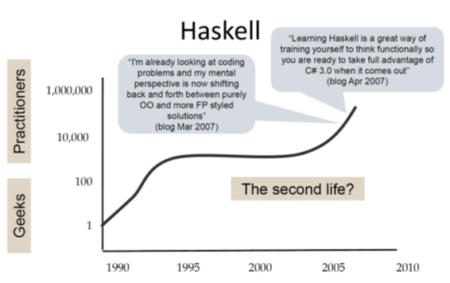

# Why Haskell Matters

This is an early draft of  a work in progress article.

> Haskell doesn't solve different problems than other languages.
> But it solves them differently.
> 
> -- unknown

## Abstract

In this article I'm presenting some of the most important and distinguishing features of the Haskell
programming language.

The target audience are developers with a background in non-functional languages who are eager
to learn about concepts of functional programming and Haskell in particular.

The presentation aims to be self-contained and does not require any previous knowledge of the language.
I will also try to keep the learning curve moderate and to limit the scope of the presentation;
nevertheless this article is not meant to be a full introduction to the language.

(If you looking for an enjoyable tutorial have a look at [Learn You a Haskell](http://www.learnyouahaskell.com/.)


## Table of contents

- [Introduction](#introduction)
- [Functions are first class](#functions-are-first-class)
- [Pattern matching (part 1)](#pattern-matching-part-1)
- [Algebraic Data Types](#algebraic-data-types)
- [Polymorphic Data Types](#polymorphic-data-types)
  - [Lists](#lists)
- [Declarative programming](#declarative-programming)
- [Non-strict Evaluation](#non-strict-evaluation)

## Introduction

Exactly thirty years ago, on April 1st 1990, the original Haskell language report was published
by a small group of academic researchers in the field of non-strict functional programming.

Haskell never became one of the most popular languages in the software industry or part of the mainstream 
but it has been and still is quite influential in the software development community.

In this article I want to explain why Haskell keeps to be such an important language by presenting some
of its most distinguishing features and detailing them with working code examples.

But before diving directly into the technical details I'd like to first have a closer look on the reception of 
Haskell in the software developers community:

### A strange development over time

In a talk in 2017 on [the Haskell journey](https://www.youtube.com/watch?v=re96UgMk6GQ) 
since its beginnings in the 1980ies Simon Peyton Jones speaks about the
rather unusual life story of Haskell.

First he talks about the typical life cycle of research languages. They are often created by 
a single researcher (who is also the single user) and most of them will be abandoned 
after just a few years.

A more successful research language might gain some interest in a larger community 
but will still not escape the ivory tower and typically will be given up within ten years.

On the other hand we have all those popular programming languages that are quickly adopted by 
large numbers of users and thus reach "the threshold of immortality".
That is the base of existing code will grow so large that the language will 
be in use for decades.

A little jokingly he then depicts the sad fate of languages designed by 
committees by flat line through zero: They simply never take off.

Finally he presents a chart showing the Haskell timeline:



The development shown in this chart seems rather unexpected: 
Haskell started as a research language and was even designed by a committee; 
so in all probability it should have been abandoned long before the millennium!

But instead it gained some momentum in its early years followed by a rather quiet phase during 
the decade of OO hype (Java was released in 1995).
And then again we see a continuous growth of interest since about 2005. 
I'm writing this in early 2020 and we still see this trend!

### Being used versus being discussed

Then Simon Peyton Jones points out another interesting characteristic of the reception of Haskell 
in recent years:
In statics that rank programming languages by actual usage Haskell is typically not under the 30 most active languages.
But in statistics that instead rank languages by the volume of discussions on the internet
Haskell typically scores much better (often in the top ten).

### So why does Haskell keep to be a hot topic in the software development community?

A very *short answer* might be: 
Haskell has a number of features that are clearly different from those of most other programming languages. 
Many of these features have proven to be powerful tools to solve basic problems of software development elegantly.

Therefore over time other programming languages have adopted parts of these concepts (e.g. pattern matching or type classes).
In discussions about such concepts the Haskell heritage is mentioned 
and differences between the original Haskell concepts and those of other languages are discussed.
Sometimes people are encouraged to have a closer look at the source of these concepts to get a deeper understanding of
their original intentions. That's why we see a growing number of developers working in
Python, Typescript, Scala, Rust, C++, C# or Java starting to dive into Haskell.

A further essential point is that Haskell is still an experimental laboratory for research in areas such as
compiler construction, programming language design, theorem-provers, type systems etc.
So inevitably Haskell will be a topic in the discussion about these approaches.

In the following sections we will try to find the *longer answer* by
studying some of the most distinguishing features of Haskell.

## Functions are First-class

> In computer science, a programming language is said to have first-class functions if it treats functions as 
> first-class citizens. This means the language supports **passing functions as arguments to other functions**, 
> **returning them as the values from other functions**, and **assigning them to variables or storing them in data 
> structures.**[1] Some programming language theorists require **support for anonymous functions** (function literals) 
> as well.[2] In languages with first-class functions, the names of functions do not have any special status; 
> they are treated like ordinary variables with a function type.
> 
> quoted from [Wikipedia](https://en.wikipedia.org/wiki/First-class_function)

We'll go through this one by one:

### functions can be assigned to variables exactly as any other other values

Let's have a look how this looks like in Haskell. First we define some simple values:

```haskell
-- define constant `aNumber` with a value of 42. 
aNumber :: Integer
aNumber = 42

-- define constant `aString` with a value of "hello world"
aString :: String
aString = "Hello World"
```

In the first line we see a type signature that defines the constant `aNumber` to be of type `Integer`.
In the second line we define the value of `aNumber` to be `42`.
In the same way we define the constant `aString` to be of type `String`.

Next we define a function `square` that takes an integer argument and returns the square value of the argument:
```Haskell
square :: Integer -> Integer
square x = x * x
```

Definition of a function works exactly in the same way as the definition of any other value.
The only thing special is that we declare the type to be a **function type** by using the `->` notation.
So `:: Integer -> Integer` represents a function from `Integer` to `Integer`.
In the second line we define function `square` to compute `x * x` for any `Integer` argument `x`.

Ok, seems not too difficult, so let's define another function `double` that doubles its input value:

```haskell
double :: Integer -> Integer
double n = 2 * n
```

### support for anonymous functions

Anonymous functions, also known as lambda expressions, can be defined in Haskell like this:

```Haskell
\x -> x * x
```

This expression denotes an anonymous function that takes a single argument x and returns the square of that argument.
The backslash is read as λ (the greek letter lambda). 

You can use such as expressions everywhere where you would use any other function. For example you could apply the 
anonymous function `\x -> x * x` to a number just like the named function `square`:

```haskell
-- use named function:
result = square 5

-- use anonymous function:
result' = (\x -> x * x) 5
```

We will see more useful applications of anonymous functions in the following section.

### Functions can be returned as values from other functions

#### function composition

Do you remember *function composition* from your high-school math classes? 
Function composition is an operation that takes two functions `f` and `g` and produces a function `h` such that 
`h(x) = g(f(x))`
The resulting composite function is denoted `h = g ∘ f` where  `(g ∘ f )(x) = g(f(x))`.
Intuitively, composing functions is a chaining process in which the output of function `f` is used as input of function `g`.

So looking from a programmers perspective the `∘` operator is a function that 
takes two functions as arguments and returns a new composite function.

In Haskell this operator is represented as the dot operator `.`:

```haskell
(.) :: (b -> c) -> (a -> b) -> a -> c
(.) f g x = f (g x)
```

The brackets around the dot are required as we want to use a non-alphabetical symbol as an identifier.
In Haskell such identifiers can be used as infix operators (as we will see below).
Otherwise `(.)` is defined as any other function. 
Please also note how close the syntax is to the original mathematical definition.

Using this operator we can easily create a composite function that first doubles 
a number and then computes the square of that doubled number:

```haskell
squareAfterDouble :: Integer -> Integer
squareAfterDouble = square . double
```

#### Currying and Partial Application

In this section we look at another interesting example of functions producing 
other functions as return values.
We start by defining a function `add` that takes two `Integer` arguments and computes their sum:

```haskell
-- function adding two numbers 
add :: Integer -> Integer -> Integer
add x y = x + y
```

This look quite straightforward. But still there is one interesting detail to note:
the type signature of `add` is not something like 

```haskell
add :: (Integer, Integer) -> Integer
```

Instead it is:

```haskell
add :: Integer -> Integer -> Integer
```

What does this signature actually mean?
It can be read as "A function taking an Integer argument and returning a function of type `Integer -> Integer`".
Sounds weird? But that's exactly what Haskell does internally. 
So if we call `add 2 3` first `add` is applied to `2` which return a new function of type `Integer -> Integer` which is then applied to `3`.

This technique is called [**Currying**](https://wiki.haskell.org/Currying)

Currying is widely used in Haskell as it allows another cool thing: **partial application**.

In the next code snippet we define a function `add5` by partially applying the function `add` to only one argument:

```haskell
-- partial application: applying add to 5 returns a function of type Integer -> Integer
add5 :: Integer -> Integer
add5 = add 5
```

The trick is as follows: `add 5` returns a function of type `Integer -> Integer` which will add `5` to any Integer argument.

Partial application thus allows us to write functions that return functions as result values.
This technique is frequently used to 
[provide functions with configuration data](https://github.com/thma/LtuPatternFactory#dependency-injection--parameter-binding-partial-application).

### Functions can be passed as arguments to other functions

I could keep this section short by telling you that we have already seen an example for this:
the function composition operator `(.)`.
It **accepts two functions as arguments** and returns a new one as in:

```haskell
squareAfterDouble :: Integer -> Integer
squareAfterDouble = square . double
```

But I have another instructive example at hand.

Let's imagine we have to implement a function that doubles any odd Integer:

```haskell
ifOddDouble :: Integer -> Integer
ifOddDouble n =
  if odd n
    then double n
    else n
```

The Haskell code is straightforward: new ingredients are the `if ... then ... else ...` and the
odd `odd` which is a predicate from the Haskell standard library 
that returns `True` if an integral number is odd.

Now let's assume that we also need another function that computes the square for any odd number.
As you can imagine we can use the standard library predicate `even`: 

```haskell
ifOddSquare :: Integer -> Integer
ifOddSquare n =
  if odd n
    then square n
    else n
```

As vigilant developers we immediately detect a violation of the 
[Don't repeat yourself principle](https://en.wikipedia.org/wiki/Don%27t_repeat_yourself) as 
both functions only vary in the usage of a different growth functions `double` versus `square`.

So we are looking for a way to refactor this code by a solution that keeps the original
structure but allows to vary the used growth function.

What we need is a function that takes a growth function (of type `(Integer -> Integer)`) 
as first argument, an `Integer` as second argument
and returns an `Integer`. The specified growth function will be applied in the `then` clause:

```haskell
ifOdd :: (Integer -> Integer) -> Integer -> Integer
ifOdd growthFunction n =
  if odd n
    then growthFunction n
    else n
```

With this approach we can refactor `ifOddDouble` and `ifOddSquare` as follows:

```haskell
ifOddDouble :: Integer -> Integer
ifOddDouble n = ifOdd double n

ifOddSquare :: Integer -> Integer
ifOddSquare n = ifOdd square n
```

Now imagine that we have to implement new function `ifEvenDouble` and `ifEvenSquare`, that
will work only on even numbers. Instead of repeating ourselves we come up with a function
`ifPredGrow` that takes a predicate function of type `(Integer -> Bool)` as first argument, 
a growth function of type `(Integer -> Integer)` as second argument and an Integer as third argument, 
returning an `Integer`.

The predicate function will be used to determine whether the growth function has to be applied:

```haskell
ifPredGrow :: (Integer -> Bool) -> (Integer -> Integer) -> Integer -> Integer
ifPredGrow predicate growthFunction n =
  if predicate n
    then growthFunction n
    else n
```

Using this [higher order function](https://en.wikipedia.org/wiki/Higher-order_function) 
that even takes two functions as arguments we can write the two new functions and 
further refactor the existing ones without breaking the DRY principle:

```haskell
ifEvenDouble :: Integer -> Integer
ifEvenDouble n = ifPredGrow even double n

ifEvenSquare :: Integer -> Integer
ifEvenSquare n = ifPredGrow even square n

ifOddDouble'' :: Integer -> Integer
ifOddDouble'' n = ifPredGrow odd double n

ifOddSquare'' :: Integer -> Integer
ifOddSquare'' n = ifPredGrow odd square n
```

## Pattern matching (part 1)

With the things that we have learnt so far, we can now start to implement some more interesting functions.
So what about implementing the recursive [factorial function](https://en.wikipedia.org/wiki/Factorial)?

The factorial function can be defined as follows:
 
> For all n ∈ ℕ<sub>0</sub>:
>```
>0! = 1
>n! = n * (n-1)!
>```

With our current knowledge of Haskell we can implement this as follows:

```haskell
factorial :: Natural -> Natural
factorial n =
  if n == 0
    then 1
    else n * factorial (n - 1)
```

We are using the Haskell data type `Natural` to denote the set of non-negative integers ℕ<sub>0</sub>.
Using the literal `factorial` within the definition of the function `factorial` works as expected and denotes a 
recursive function call.

As these kind of recursive definition of functions are typical for functional programming, the language designers have
added a useful feature called *pattern matching* that allows to define functions by a set of equations:

```haskell
fac :: Natural -> Natural
fac 0 = 1
fac n = n * fac (n - 1)
```

This style comes much closer to the mathematical definition and is typically more readable, as it helps to avoid
nested `if ... then ... else ...` constructs.

Pattern matching can not only be used for numeric values but for any other data types. 
We'll see some more examples shortly.

## Algebraic Data Types

Haskell supports user-defined data types by making use of a very thought out concept.
Let's start with a simple example:

```haskell
data Status = Green | Yellow | Red
```

This declares a data type `Status` which has exactly three different instances. For each instance a
*data constructor* is defined that allows to create a new instance of the data type.

Each of those data constructors is a function (in this simple case a constant) that returns a `Status` instance.

The type `Status` is a so called *sum type* as it is represents the set defined by the sum of all three 
instances `Green`, `Yellow`, `Red`. In Java this corresponds to Enumerations.

Let's assume we have to create a converter that maps our `Status` values to `Severity` values 
representing severity levels in some other system.
This converter can be written using the pattern matching syntax that we already have seen above:

```haskell
-- another sum type representing severity:
data Severity = Low | Middle | High deriving (Eq, Show)

severity :: Status -> Severity
severity Green  = Low
severity Yellow = Middle
severity Red    = High
```

The compiler will tell us when we did not cover all instances of the `Status` type 
(by making use of the `-fwarn-incomplete-patterns` pragma).

Now we look at data types that combine multiple different elements, like pairs n-tuples, etc.
Let's start with a `PairStatusSeverity` type that combines two different elements:

```haskell
data PairStatusSeverity = P Status Severity
```

This can be understood as: data type `PairStatusSeverity` can be constructed from a
data constructor `P` that takes a value of type `Status` and a value of type `Severity` and returns a `Pair` instance.

So for example `P Green High` returns a `PairStatusSeverity` instance
(the data constructor `P`  has the signature `P :: Status -> Severity -> PairStatusSeverity`).

The type `PairStatusSeverity` can be interpreted as the set of all possible ordered pairs of Status and Severity values, 
that is the *cartesian product* of `Status` and `Severity`.

That's why such a data type is called *product type*. 

Haskell allows you to create arbitrary data types by combining *sum types* and *product types*. The complete
range of data types that can be constructed in this way is called 
[*algebraic data types*](https://en.wikipedia.org/wiki/Algebraic_data_type) or ADT in short.

Using algebraic data types has several advantages:

- Pattern matching can be used to analyze any concrete instance to select different behaviour based on input data.
  as in the example that maps `Status` to `Severity` there is no need to use `if..then..else..` constructs.
- The compiler can detect incomplete patterns matching or other flaws.
- The compiler can derive many complex functionality automatically for ADTs as they are constructed in
  such a regular way.
  
We will cover the interesting combination of ADTs and pattern matching in the following sections.  
  
## Polymorphic Data Types

Forming pairs or more generally n-tuples is a very common task in programming. 
Therefore it would be inconvenient and repetitive if we were forced to create new Pair or Tuple types
for each concrete usage. consider the following example:

```haskell
data PairStatusSeverity = P Status Severity

data PairStatusString   = P' Status String

data PairSeverityStatus = P'' Severity Status
```

Luckily data type declarations allow to use type variables to avoid this kind of cluttered code.
So we can define a generic data type `Pair` that allows us to freely combine different kinds of arguments:

```haskell
-- a simple polymorphic type
data Pair a b = P a b
```

This can be understood as: data type `Pair` uses two elements of (potentially) different types `a` and `b`; the
data constructor `P` takes a value of type `a` and a value of type `b` and returns a `Pair a b` instance 
(the data constructor `P`  has the signature `P :: a -> b -> Pair a b`).
The type `Pair` can now be used to create many different concrete data types it is thus 
called a *polymorphic* data type.

As pairs and n-tuples are so frequently used, the Haskell language designers have added some syntactic sugar to
work effortlessly with them.

So you can simply write tuples like this:

```haskell
tuple :: (Status, Severity, String)
tuple = (Green, Low, "All green")
```

### Lists

Another very useful polymorphic type is the `List`.

A list can either be the empty list (denoted by the data constructor `[]`) 
or some element of a data type `a` followed by a list with elements of type `a`, denoted by `[a]`.

This intuition is reflected in the following data type definition:

```haskell
data [a] = [] | a : [a]
```

The cons operator `(:)` (which is an infix operator like `(.)` from the previous section) is declared as a 
*data constructor* to construct a list from a single element of type `a` and a list of type `[a]`.

So a list containing only a single element `1` is constructed by:

```haskell
1 : []
```

A list containing the three numbers 1, 2, 3 is constructed like this:

```haskell
1 : 2 : 3 : []
```

Luckily the Haskell language designers have been so kind to offer some syntactic sugar for this. 
So the first list can simply be written as `[1]` and the second as `[1,2,3]`.

Polymorphic type expressions describe *families of types*. 
For example, `(forall a)[a]` is the family of types consisting of, 
for every type `a`, the type of lists of `a`. 
Lists of integers (e.g. `[1,2,3]`), lists of characters (`['a','b','c']`), 
even lists of lists of integers, etc., are all members of this family. 

Function that work on lists can use pattern matching to select behaviour for the `[]` and the `a:[a]` case.

Take for instance the definition of the function `length` that computes the length of a list:

```haskell
length :: [a] -> Integer
length []     =  0
length (x:xs) =  1 + length xs
```

We can read these equations as: The length of the empty list is 0, 
and the length of a list whose first element is x and remainder is xs 
is 1 plus the length of xs.


In our next example we want to work with a of some random integers:
```haskell
someNumbers :: [Integer]
someNumbers = [49,64,97,54,19,90,934,22,215,6,68,325,720,8082,1,33,31]
```

Now we want to select all even or all odd numbers from this list. 
We are looking for a function `filter` that takes two
arguments: first a predicate function that will be used to check each element
and second the actual list of elements. The function will return a list with all matching elements.
And of course our solution should work not only for Integers but for any other types as well.
Here is the type signature of such a filter function:

```haskell
filter :: (a -> Bool) -> [a] -> [a]
```

In the implementation we will use pattern matching to provide different behaviour for the `[]` and the `(x:xs)` case:

```haskell
filter :: (a -> Bool) -> [a] -> [a]
filter pred []     = []
filter pred (x:xs)
  | pred x         = x : filter pred xs
  | otherwise      = filter pred xs
```

The `[]` case is obvious. To understand the `(x:xs)` case we have to know that in addition to simple matching of the type constructors
we can also use *pattern guards* to perform additional testing on the input data.
In this case we compute `pred x` if it evaluates to `True`, `x` is a match and will be cons'ed with the result of 
`filter pred xs`.
If it does not evaluate to `True`, 
we will not add `x` to the result list and thus simply call filter recursively on the remainder of the list.

Now we can use `filter` to select elements from our sample list:

```haskell
someEvenNumbers :: [Integer]
someEvenNumbers = filter even someNumbers

-- predicates may also be lambda-expresssions
someOddNumbers :: [Integer]
someOddNumbers = filter (\n -> n `rem` 2 /= 0) someNumbers  
```

Of course we don't have to invent functions like `filter` on our own but can rely on the [extensive set of 
predefined functions working on lists](https://hackage.haskell.org/package/base-4.12.0.0/docs/Data-List.html) 
in the Haskell base library.

#### Arithmetic sequences

There is a nice feature that often comes in handy when dealing with lists of numbers. It's called *arithmetic sequences* and
allows you to define lists of numbers with a concise syntax:

```haskell
upToHundred :: [Integer]
upToHundred = [1..100]
```

As expected this assigns `upToHundred` with a list of integers from 1 to 100.

It's also possible to define a step width that determines the increment between the subsequent numbers.
If we want only the odd numbers we can construct them like this:
```haskell
oddsUpToHundred :: [Integer]
oddsUpToHundred = [1,3..100]
```

Arithmetic sequences can also be used in more dynamic cases. For example we can define the `factorial` function like this:
```math
n! = 1 * 2 * 3 ... (n-2) * (n-1) * n, for integers > 0
```

In Haskell we can use an arithmetic sequence to define this function:

```haskell
fac' n   = prod [1..n]
```


## Declarative programming

In this section I want to explain how programming with *higher order* functions can be used to
factor out many basic control structures and algorithms from the user code.

This will result in a more *declarative programming* style where the developer can simply 
declare *what* she wants to achieve but is not required to write down *how* it is to be achieved.

Code that applies this style will be much denser and it will be more concerned with the actual elements
of the problem domain than with the technical implementation details.

We'll demonstrate this with some examples working on lists. 
First we get the task to write a function that doubles all elements of a `[Integer]` list.
We want to reuse the `double` function we have already defined above.

With all that we have learnt so far writing a function `doubleAll` isn't that hard:

```haskell
-- compute the double value for all list elements
doubleAll :: [Integer] -> [Integer]
doubleAll [] = []
doubleAll (n:rest) = double n : doubleAll rest
```

Next we are asked to implement a similar function `squareAll` that will use `square` to compute the square of all elements in a list.
The naive way would be to implement it in the *WET* (We Enjoy Typing) approach:

```haskell
-- compute squares for all list elements
squareAll :: [Integer] -> [Integer]
squareAll [] = []
squareAll (n:rest) = square n : squareAll rest
```

Of course this is very ugly: 
both function use the same pattern matching and apply the same recursive iteration strategy.
They only differ in the function applied to each element.

As role model developers we don't want to repeat ourselves.  We are thus looking for something that 
captures the essence of mapping a given function over a list of elements:

```haskell
map :: (a -> b) -> [a] -> [b]
map f []     = []
map f (x:xs) = f x : map f xs
```

This function abstracts away the implementation details of iterating over a list and allows to provide a user defined 
mapping function as well.

Now we can use `map` to simply *declare our intention* (the 'what') and don't have to detail the 'how':

```haskell
doubleAll' :: [Integer] -> [Integer]
doubleAll' = map double

squareAll' :: [Integer] -> [Integer]
squareAll' = map square
```

### folding or reducing

Now let's have a look at some related problem.
Our first task is to add up all elements of a  `[Integer]` list.
First the naive approach which uses the already familiar mix of pattern matching plus recursion:

```haskell
sumUp :: [Integer] -> Integer
sumUp [] = 0
sumUp (n:rest) = n + sumUp rest
```

By looking at the code for a function that computes the product of all elements of a  `[Integer]` list we can again see that
we are repeating ourselves:

```haskell
prod :: [Integer] -> Integer
prod [] = 1
prod (n:rest) = n * prod rest
```

So what is the essence of both algorithms?
At the core of both algorithms we have a recursive function which 

- takes a binary operator (`(+)`or `(*)` in our case), 
- an initial value that is used as a starting point for the accumulation 
  (typically the identity element (or neutral element) of the binary operator), 
- the list of elements that should be reduced to a single return value
- performs the accumulation by recursively applying the binary operator to all elements of the list until the `[]` is reached,
  where the neutral element is returned.

This essence is contained in the higher order function `foldr` which again is part of the Haskell standard library:

```haskell
foldr :: (a -> b -> b) -> b -> [a] -> b
foldr f acc []     =  acc
foldr f acc (x:xs) =  f x (foldr f acc xs)
```

Now we can use `foldr` to simply *declare our intention* (the 'what') and don't have to detail the 'how':

```haskell
sumUp' :: [Integer] -> Integer
sumUp' = foldr (+) 0

prod' :: [Integer] -> Integer
prod' = foldr (*) 1
```

With the functions `map` and `foldr` (or `reduce`) we have now two very powerful tools at hand that can be used in
many situation where list data has to be processed.

Both functions can even be composed to form yet another very important programming concept: *Map/Reduce*.
In Haskell this operation is provided by the function `foldMap`.

I won't go into details here as it would go beyond the scope of this article. But I'll invite you to read my 
[introduction to Map/Reduce in Haskell](https://github.com/thma/LtuPatternFactory#map-reduce).

## Non-strict Evaluation

Now we come to topic that was one of the main drivers for the Haskell designers: they wanted to get
away from the then standard model of strict evaluation.

Non-Strict Evaluation (aka. normal order reduction) has one very important property. 
 
> If a lambda expression has a normal form, then normal order reduction will terminate and find that normal form.
>
> Church-Rosser Theorem II

This property does not hold true for other reduction strategies (like applicative order or call-by-value reduction).

This result from mathematical research on the [lambda calculus](https://en.wikipedia.org/wiki/Lambda_calculus) 
is important as Haskell maintains the semantics of normal order reduction.

The real-world benefits of lazy evaluation include:

- Avoid endless loops in certain edge cases
- The ability to define control flow (structures) as abstractions instead of primitives.
- The ability to define potentially infinite data structures. This allows for more straightforward implementation of some algorithms.

So let's have a closer look at those benefits:

### Avoid endless loops in certain edge cases

Consider the following example function:

```haskell
ignoreY :: Integer -> Integer -> Integer
ignoreY x y = x
```

It takes two integer arguments and returns the first one unmodified. The second argument is 
simply ignored.

In most programming languages both arguments will be
evaluated before the function body is executed: 
they use applicative order reduction aka. eager evaluation or call-by-value semantics.

In Haskell on the other hand it is save to call the function with a non-terminating expression in the second argument.
First we create a non-terminating expression `viciousCircle`. Any attempt to evaluate it will result in an endless loop:

```haskell
-- it's possible to define non-terminating expressions like
viciousCircle :: a
viciousCircle = viciousCircle
```

But if we use `viciousCircle` as second argument to the function `ignoreY` it will simply be ignored and the first argument
is returned:

```haskell
-- trying it in GHCi:
λ> ignoreY 42 viciousCircle
42
```

### Define potentially infinite data structures

In the [section on lists](#lists) we have already met *arithmetic sequences* like `[1..10]`.

Arithmetic sequences can also be used to define infinite lists of numbers.
Here are a few examples:

```haskell
-- all natural numbers
naturalNumbers = [1..]

-- all even numbers
evens = [2,4..]

-- all odd numbers
odds  = [1,3..]
```

Defining those infinite lists is rather easy. But can we do with them? Are they useful for any purpose? In the `viciousCircle` example above we have learnt that
defining that expression is fine but any attempt to evaluate it will result in an infinite loop.

If we try to print `naturalNumbers` we will also end up in an infinite loop of integers printed to the screen.

But if we are bit less greedy than asking for all natural numbers everything will be OK.

```haskell
λ> take 10 naturalNumbers
[1,2,3,4,5,6,7,8,9,10]

λ> take 10 evens
[2,4,6,8,10,12,14,16,18,20]

λ> take 10 odds
[1,3,5,7,9,11,13,15,17,19]
```

We can also peak at a specific position in such an infinite list, using the `(!!)` operator:

```haskell
λ> odds !! 5000
10001

λ> evens !! 10000
20002
```

### List comprehension

Do you remember *set comprehension* notation from your math classes?

As simple example would be the definition of the set of even numbers:

> Evens = {i | i = 2n ∧ n ∊ ℕ}

Which can be read as: Evens is defined as the set of all `i` where `i = 2*n` and `n` is an element of the set of natural numbers.

The Haskell *list comprehension* allows us to define - potentially infinite - lists with a similar syntax:

```haskell
evens' = [2*n | n <- [1..]]
```

Again we can avoid infinite loops by evaluating only a finite subset of `evens'`:

```haskell
λ> take 10 evens'
[2,4,6,8,10,12,14,16,18,20]
```

List comprehension can be very useful for defining numerical sets in a very declarative way that comes quite close to
the original mathematical definitions.

Take for example the set `PT` of all pythagorean triples

>  PT = {(a,b,c) | a,b,c ∊ ℕ ∧ a² + b² = c² }

The Haskell definition looks like this:

```haskell
pt :: [(Natural,Natural,Natural)]
pt = [(a,b,c) | c <- [1..],
                b <- [1..c],
                a <- [1..b],
                a^2 + b^2 == c^2]
```


### define control flow structures as abstractions instead of primitives

In most languages it is not possible to define new conditional operations, e.g. your own `myIf` statement.
A conditional operation will evaluate some of its arguments only if certain conditions are met.
This is very hard to implement in language with call-by-value semantics which evaluates all function arguments before
actually evaluating the function body.

As Haskell implements call-by-need semantics, it is quite possible to define new conditional operations.
In fact this is quite helpful when writing *domain specific languages*.


---
---

This is my scrap book (don't look at it)

- Funktionen sind 1st class citizens (higher order functions, Funktionen könen neue Funktionen erzeugen und andere Funktionen als Argumente haben)

- Abstraktion über Resource management und Abarbeitung (=> deklarativ)

- Immutability ("Variables do not Vary")

- Seiteneffekte müssen in Funktions signaturen explizit gemacht werden.
D.H wenn keine Seiteneffekt angegeben ist, verhindert der Compiler, dass welche auftreten !
Damit lässt sich Seiteneffektfreie Programmierung realisieren ("Purity")

- Evaluierung in Haskell ist "non-strict" (aka "lazy"). Damit lassen sich z.B. abzählbar unendliche Mengen (z.B. alle Primzahlen) sehr elegant beschreiben.
  Aber auch kontrollstrukturen lassen sich so selbst bauen (super für DSLs) 

- Static and Strong typing (Es gibt kein Casting)

- Type Inferenz. Der Compiler kann die Typ-Signaturen von Funktionen selbst ermitteln. (Eine explizite Signatur ist aber möglich und oft auch sehr hilfreich für Doku und um Klarheit über Code zu gewinnen.)

- Polymorphie (Z.B für "operator overloading", Generische Container Datentypen, etc. auf Basis von "TypKlassen")

- Algebraische Datentypen (Summentypen + Produkttypen) AD helfen typische Fehler, die man von OO Polymorphie kenn zu vermeiden. Sie erlauben es, Code für  viele Oerationen auf Datentypen komplett automatisch vom Compiler generieren zu lassen).

- Pattern Matching erlaubt eine sehr klare Verarbeitung von ADTs

- Eleganz: Viele Algorithmen lassen sich sehr kompakt und nah an der Problemdomäne formulieren.

- Data Encapsulation durch Module


- Weniger Bugs durch

    - Purity, keine Seiteneffekte

    - Starke typisierung. Keine NPEs !

    - Hohe Abstraktion, Programme lassen sich oft wie eine deklarative Spezifikation des Algorithmus lesen

    - sehr gute Testbarkeit durch "Composobility"
    
        - das "ports & adapters" Beispiel: https://github.com/thma/RestaurantReservation
        
        - TDD / DDD
    
    - Memory Management (sehr schneller GC)

    - Modulare Programme. Es gibt ein sehr einfaches aber effektive Modul System und eine grosse Vielzahl kuratierter Bibliotheken.

    ("Ich habe in 5 Jahre Haskell noch nicht ein einziges Mal debuggen müssen")

- Performance: keine VM, sondern sehr optimierter Maschinencode. Mit ein wenig Feinschliff lassen sich oft Geschwindigkeiten wie bei handoptimiertem C-Code erreichen. 


## toc for code chapters (still in german)

- Werte
- Funktionen
- Listen
- Lazyness
    - List comprehension
    - Eigene Kontrollstrukturen
    
- Algebraische Datentypen
    - Summentypen : Ampelstatus
    - Produkttypen (int, int)
      Beispiel: Baum mit Knoten (int, Ampelstatus) dann mit map ein Ampelstatus
- deriving (Show, Read) für einfache Serialisierung
- Homoiconicity (Kind of)
- Maybe Datentyp
    - totale Funktionen
    - Verkettung von Maybe operationen  
      (um die "dreadful Staircase" zu vermeiden)
      => Monoidal Operations
      
 - explizite Seiten Effekte -> IO Monade
 
 - TypKlassen
   - Polymorphismus
     z.B. Num a, Eq a
   - Show, Read => Homoiconicity bei Serialisierung
   - Automatic deriving
     (Functor mit Baum Beispiel)
     
- Testbarkeit
    - TDD, higher order functions assembly, Typklassen dispatch (https://jproyo.github.io/posts/2019-03-17-tagless-final-haskell.html)
    